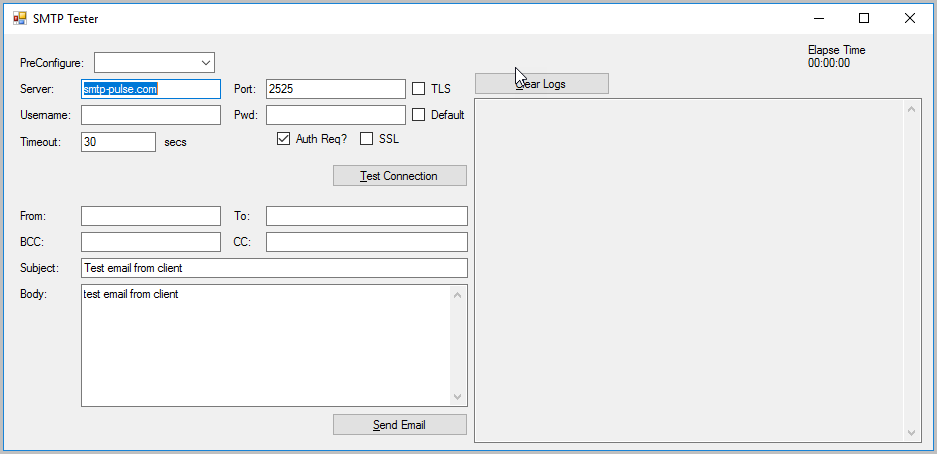

# smtptest
This is sample project to test the smtp server using .NET mail and TCP classes

# Screen shot

'Test connection' will open TCP client and fire ELHO and other SMTP server to check if SMTP exists and up and running
'Send Email' will send email using the SMTP server
